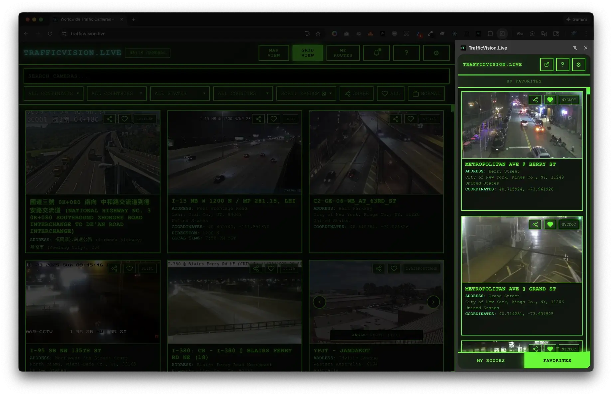

# [TrafficVision.Live](https://trafficvision.live/?utm_source=github&utm_medium=repo&utm_campaign=trafficvision-chrome-extension) Chrome Extension

A Chrome extension that provides quick access to your favorite traffic cameras and custom routes from [TrafficVision.Live](https://trafficvision.live/?utm_source=github&utm_medium=repo&utm_campaign=trafficvision-chrome-extension).

<p align="center">
  <a href="https://trafficvision.live/?utm_source=github&utm_medium=repo&utm_campaign=trafficvision-chrome-extension">
    
  </a>
</p>

## Demo

<a href="https://www.youtube.com/watch?v=4kf0Lyx2l64" target="_blank">
  
</a>


## Screenshot


## Features

- Access your favorite traffic cameras instantly from the Chrome side panel
- View your saved routes
- Resizable side panel interface for flexible viewing
- Seamless authentication with the main [TrafficVision.Live](https://trafficvision.live/?utm_source=github&utm_medium=repo&utm_campaign=trafficvision-chrome-extension) site
- Background music streaming (Nightride FM) that continues even when side panel is closed

## Installation

1. Download `TrafficVisionLive-Chrome.zip` from this repository
1. Open Chrome and navigate to `chrome://extensions/`
1. Enable **Developer mode** using the toggle in the top right corner
1. Drag and drop the zip file onto the extensions page, or click **Load unpacked** and select the extracted folder
1. The [TrafficVision.Live](https://trafficvision.live/?utm_source=github&utm_medium=repo&utm_campaign=trafficvision-chrome-extension) extension icon will appear in your Chrome toolbar

## Usage

1. Click the [TrafficVision.Live](https://trafficvision.live/?utm_source=github&utm_medium=repo&utm_campaign=trafficvision-chrome-extension) icon in your Chrome toolbar
2. The extension will open in the side panel showing your favorites view
3. Resize the side panel to your preferred width
4. Use the bottom navigation to switch between:
   - **FAVORITES** - Your favorite cameras
   - **MY ROUTES** - Your saved routes
5. Click **FULL SITE ↗** to open the full [TrafficVision.Live](https://trafficvision.live/?utm_source=github&utm_medium=repo&utm_campaign=trafficvision-chrome-extension) website in a new tab
6. Click any route or camera to view details

### Background Music

The extension supports persistent background music streaming:

1. Open the extension and click the settings icon (⚙️)
2. Click the **MUSIC** button to toggle on/off
3. Music will continue playing even when you close the side panel
4. The music stream is managed by a background service worker
5. To stop the music, reopen the extension and toggle music off

### Extension Options

Customize how the extension displays content:

1. Navigate to `chrome://extensions/`
2. Find **[TrafficVision.Live](https://trafficvision.live/?utm_source=github&utm_medium=repo&utm_campaign=trafficvision-chrome-extension)** extension
3. Click **Details**
4. Click **Extension options**
5. Choose your preferred view mode:
   - **Extension View (Recommended)** - Optimized layout for the side panel with favorites and routes. Best experience for quick camera access.
   - **Full Homepage** - Load the complete website homepage with map and all features. May require more scrolling in the side panel.
6. Click **Save Settings**
7. Close and reopen the extension to see the changes

---

## Development

### Installation (Development)

1. Clone/download this repo
1. Open Chrome and navigate to `chrome://extensions/`
1. Enable **Developer mode** using the toggle in the top right corner
1. Click **Load unpacked**
1. Select the `trafficvision-chrome-extension` folder
1. The [TrafficVision.Live](https://trafficvision.live/?utm_source=github&utm_medium=repo&utm_campaign=trafficvision-chrome-extension) extension icon will appear in your Chrome toolbar

### Packaging for Distribution

To create a distributable package for Chrome Web Store submission:

```bash
./package.sh
```

This script creates `TrafficVisionLive-Chrome.zip` containing only the necessary extension files (manifest, scripts, HTML, CSS, and icons).

## File Structure

```
trafficvision-chrome-extension/
├── manifest.json                      # Extension configuration
├── sidepanel.html                     # Side panel HTML
├── sidepanel.css                      # Side panel styling
├── sidepanel.js                       # Side panel script
├── options.html                       # Extension options/settings page
├── options.js                         # Options page logic
├── background.js                      # Service worker for music and side panel
├── offscreen.html                     # Offscreen doc for audio
├── offscreen.js                       # Audio playback handler
├── package.sh                         # Packaging script
├── TrafficVisionLive-Chrome.zip       # Pre-packaged extension
├── icons/                             # Extension icons
│   ├── icon16.png
│   ├── icon48.png
│   └── icon128.png
├── media/                             # Screenshots and assets
└── README.md                          # This file
```


## Support

For issues or questions, visit [TrafficVision.Live](https://trafficvision.live/?utm_source=github&utm_medium=repo&utm_campaign=trafficvision-chrome-extension) to contact the team.
